# Mini-Up

A full-featured gaming marketplace built with Django and PostgreSQL.

Mini-Up is an e-commerce platform focused on selling gaming services, in-game products, digital subscriptions, and mobile-related virtual services. The project includes a complete administration panel, OTP authentication, Google login, order management, ticketing system, blog management, wallet functionality, and a scalable architecture designed for future expansion.

---

## Overview

Mini-Up was designed as a production-ready marketplace rather than a simple online shop.

The platform allows customers to purchase digital gaming services, communicate with administrators through an integrated support system, manage their wallet, track orders, and authenticate securely using modern authentication methods.

The project follows a modular Django architecture, making future development and feature additions straightforward.

---

## Demo

<h2>Homepage</h2>

<p align="center">
  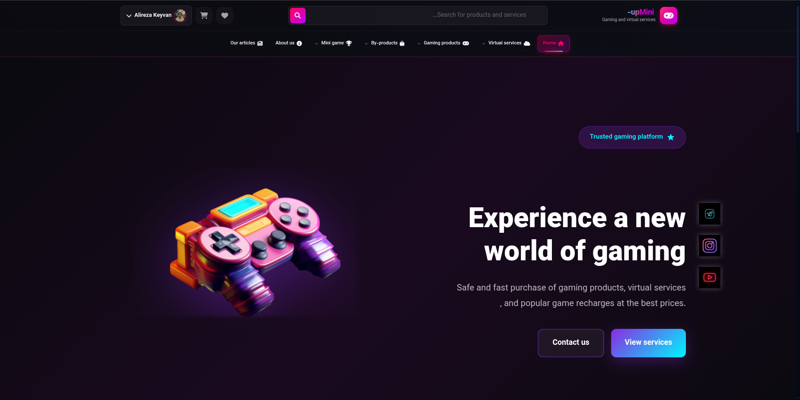
  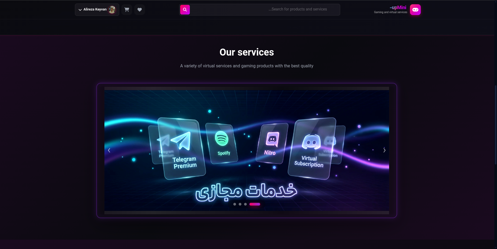
</p>
---

### Product Page
<p align="center">
  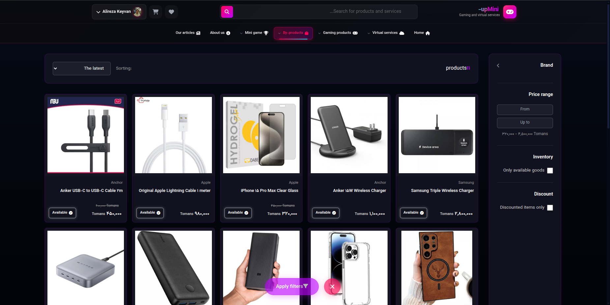
  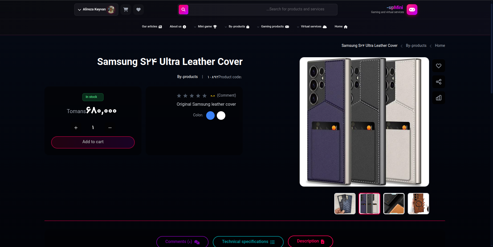
  
</p>


---

### Shopping Cart

<p align="center">
  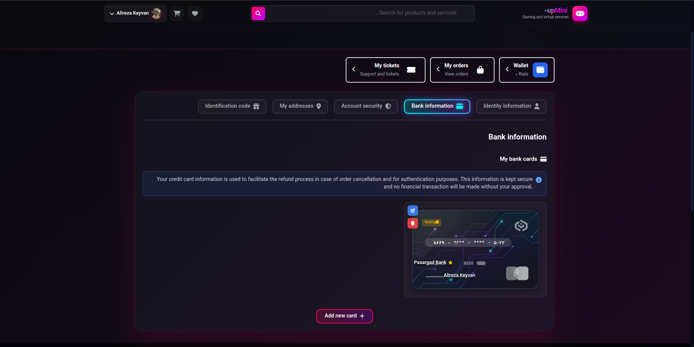
  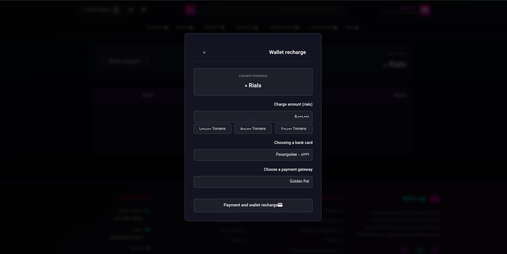
</p>
---
### Orders
<p align="center">
  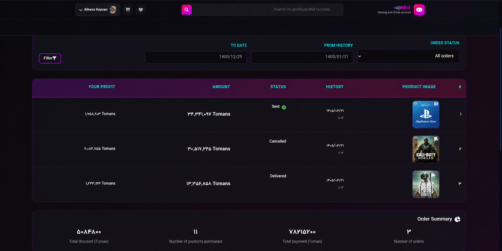
</p>

### User Dashboard
<p align="center">
  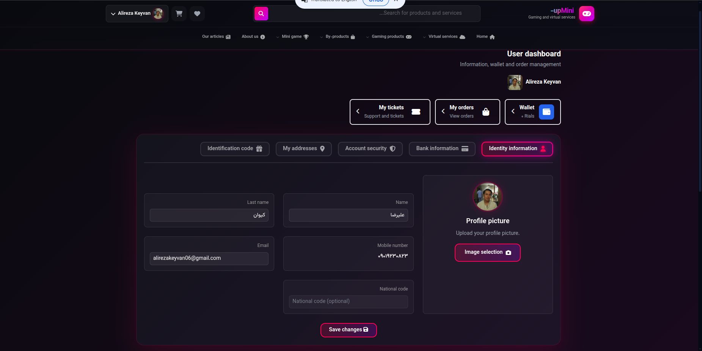
</p>
### Admin Panel

---
## Features

### Authentication
<p align="center">
  
  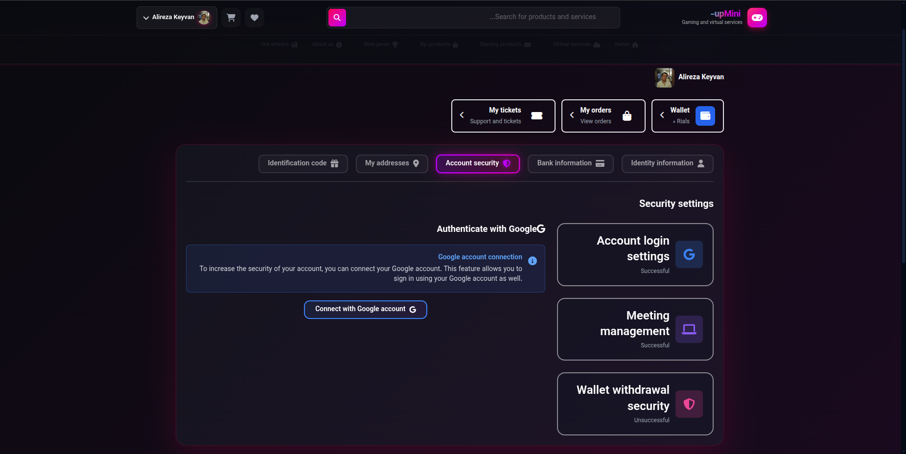
</p>
---
### E-commerce

- Physical Products
- Digital Products
- Gaming Services
- Product Categories
- Brands
- Product Reviews
- Shopping Cart
- Order Management
- Discount Coupons
---
### Support Center
<p align="center">
  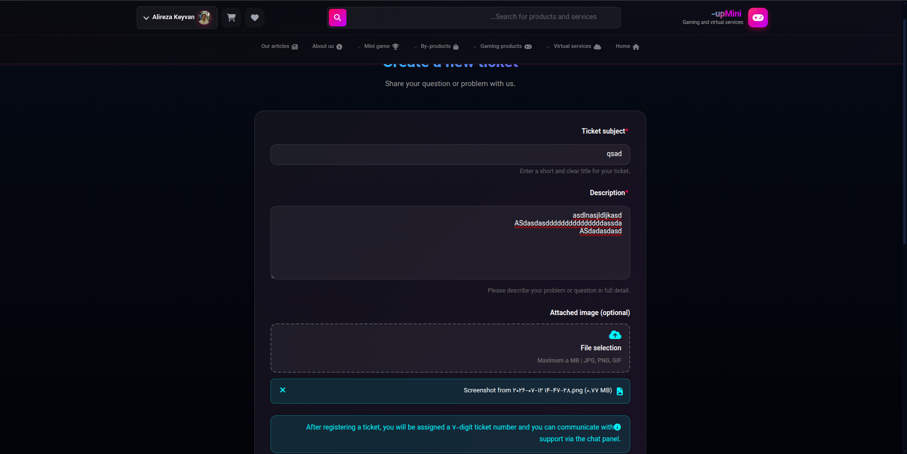
  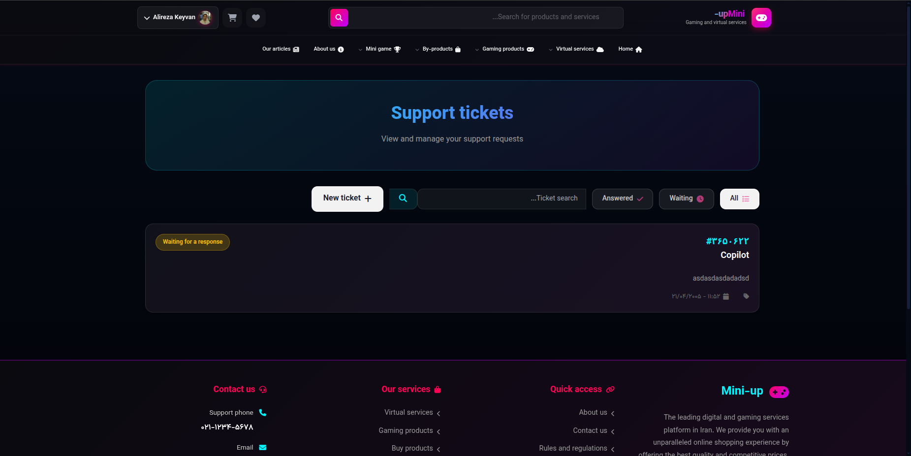
</p>

### Administration

The Django administration panel provides centralized management for:

- Users
- Products
- Categories
- Brands
- Orders
- Tickets
- Wallet
- Blog
- Site Configuration
- Payment Requests
- Coupons
- Reviews
- Uploaded Files

---

## Technology Stack

### Backend

- Python
- Django
- Django REST Ready Architecture
- PostgreSQL

### Frontend

- HTML
- CSS
- JavaScript
- Tailwind CSS

### Database

- PostgreSQL

### Deployment

- Gunicorn
- Nginx Ready
- Environment Variables
- Production Configuration

---

## Project Structure

```
mini-up/
│
├── apps/
│   ├── accounts/
│   ├── products/
│   ├── orders/
│   ├── tickets/
│   ├── wallet/
│   ├── blog/
│   └── ...
│
├── templates/
├── static/
├── media/
├── miniup/
├── requirements.txt
└── manage.py
```

---

## Security

The project includes several production-oriented practices:

- Environment-based configuration
- Protected authentication flow
- CSRF protection
- Session management
- Secure password hashing
- Google OAuth integration

---

## Database

PostgreSQL is used as the primary database.

The project contains a normalized schema supporting:

- Users
- Products
- Orders
- Wallet
- Payments
- Tickets
- Blog
- Reviews
- Coupons
- Categories
- Brands

---

### Blog

> *(Insert screenshot)*

## Future Improvements

Some planned improvements include:

- Payment gateway integration
- REST API
- Docker deployment
- Product recommendation engine
- Notification service
- Elasticsearch integration
- Redis caching
- Celery background tasks
- Admin analytics dashboard

---

## Installation

```bash
git clone https://github.com/alireza-keivan/mini-up.git

cd mini-up

python -m venv venv

source venv/bin/activate

pip install -r requirements.txt

cp .env.example .env

python manage.py migrate

python manage.py createsuperuser

python manage.py runserver
```

---

## License

This repository is intended as a portfolio project demonstrating software architecture, backend development, and scalable Django application design.
